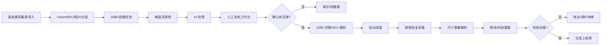

# 黑左 AI 智选静态参考架构

更新时间：2026-06-12

本文只基于可公开观察到的运行目录结构、前端调用、`.pyd` 模块名、Cython 保留符号、字符串常量和只读静态分析报告整理。后续不继续做深度反编译，也不复刻与客户端用户体系、商业授权、验证码/滑块自动处理相关的能力。

## 资料来源

- 参考运行包：`E:\ai-test\【有货源】黑左AI\`
- 前端源码/产物：`hazel_app_src`、`hazel\resources\app.asar`
- 后端模块目录：`hazel\resources\backend\_internal`
- 静态分析脚本：`reverse_engineering/analyze_pyd_modules.py`
- 静态分析报告：`reverse_engineering/hazel_pyd_report.md`
- 结构化报告：`reverse_engineering/hazel_pyd_report.json`

## 结论摘要

参考实现的大框架不是单个长脚本，而是“本地桌面前端 + 本地 HTTP API + 分阶段服务 + 表格/数据库状态”的流水线。

我们最值得借鉴的是它的分阶段模块边界：

1. 采集/导入商品。
2. 1688 图搜召回候选货源。
3. 图像向量/视觉模型/人工复核确认货源。
4. 1688 详情与 SKU 变体信息解析。
5. 自动询盘。
6. 商家回复解析尺寸重量。
7. 运费、售价、利润率计算。
8. 生成上架表或执行上架适配。

不建议照搬的是它的商业化外壳：客户端账号登录、注册码/授权、云端额度、多设备队列、自动更新、远程用户管理。你的项目是个人本机使用，应当改成本地配置、本地 SQLite、本地任务日志。

## 可借鉴模块

| 参考模块 | 静态信息显示的职责 | 我们的对应模块 |
|---|---|---|
| `controllers.desktop_api_server` | Vue/Electron 调本地 API，任务启动/停止/状态、设置、日志、询盘、回复、上架 | 本地 FastAPI/Tauri/Electron API，只保留个人任务与设置 |
| `dao.excel_dao` | Excel 表头标准化、图片写入、价格公式、上架结果回写 | Excel 导入/导出适配层，不作为核心状态源 |
| `core.automation_db` | 任务队列、货源匹配记录、1688 详情缓存、上架记录 | SQLite 仓储层，保留任务状态和中间结果 |
| `services.source_1688_service` | 1688 货源搜索主服务、候选匹配、向量/模型终审、构造匹配结果 | 1688 图搜 worker + 候选入库 + AI/人工复核 |
| `services.source_1688_detail_service` | 1688 详情页、变体、起批量、运费、规格、OCR/文本模型匹配 | 货源详情解析与 SKU/规格补全 |
| `services.image_vector_service` | 图像向量、相似度筛选、缓存 | CLIP/向量召回重排，可作为 AI 初筛 |
| `services.product_text_ocr_service` | 商品图 OCR、文本归一化、模型运行设备选择 | 图片文字提取，辅助判断是否同款/同规格 |
| `services.ai_inquiry_service` | 构造询盘消息、打开 1688 IM、发送图片/文字、写回状态 | 个人账号低频询盘任务，遇验证暂停人工处理 |
| `services.ai_reply_service` | 采集商家回复、抽取尺寸重量、写入表格/数据库 | 回复解析与尺寸重量结构化 |
| `services.ai_reply_freight_recalc_service` | 回复后重新计算运费/利润相关公式 | 尺寸重量更新后的批量重算 |
| `services.calculator_service` | 计费重、运费档位、渠道标准化 | 空运/海运/小包等物流计算 |
| `core.profit_rate_rules` | 利润、利润率、目标售价/采购价规则 | 可配置利润规则引擎 |
| `services.maozierp_excel_listing_service` | 校验 Excel 列、构造上架记录、回写上架结果 | 上架表生成器，先导出表，后续再接 ERP |
| `services.maozierp_auto_listing_service` | 浏览器上架会话、店铺选择、提交、回写结果 | 暂缓；作为未来 ERP 适配器参考 |

## 不纳入本项目的部分

| 参考实现内容 | 不做原因 | 替代设计 |
|---|---|---|
| `auth_*`、注册码、在线授权、用户额度 | 个人使用不需要商业化用户体系 | 本地配置文件 + 本机任务记录 |
| 多设备/多用户 MySQL 队列 | 个人工作流复杂度过高 | SQLite 单机任务队列 |
| 自动更新、远程版本控制 | 当前重点是工作流跑通 | 手动更新或 Git 拉取 |
| 验证/滑块自动处理模块 | 合规与稳定性风险高 | 浏览器暂停，人工处理后继续 |
| 第三方详情 API 依赖 | 你已决定主要走 1688 官方图搜/浏览器 | 官方页面解析 + 可选缓存 |
| 毛子 ERP 自动上架浏览器会话 | 不是当前主线 | 先做上架表导出，后续按平台接适配器 |

## 建议的本项目流水线

## GUI 模块拆分

| GUI 模块 | 使用者看到的动作 | 后端核心 |
|---|---|---|
| 采集表导入 | 选择 Excel，预览商品和主图 | `ImportService`、`ProductRepository` |
| 商品分组 | 按 ParentSKU/主图/标题聚合 | `ProductGroupService` |
| 1688 图搜 | 启动/暂停/重试图搜任务 | 现有 `tools/1688-image-search-worker` |
| 候选货源 | 看原图、候选图、价格、销量、店铺、相似度 | `SourceCandidateRepository` |
| AI/人工复核 | 勾选同款、拒绝、标记待确认 | `ReviewService` |
| 详情解析 | 拉取 1688 详情、SKU、起批量、运费 | `SourceDetailService` |
| 询盘任务 | 生成询盘话术，低频发送，记录状态 | `InquiryService` |
| 回复解析 | 读取回复，提取长宽高/重量/包装 | `ReplyParserService` |
| 运费利润 | 配置渠道和利润规则，批量重算 | `FreightCalculator`、`ProfitRuleEngine` |
| 上架表 | 生成平台上架 Excel | `ListingExportService` |
| 设置/日志 | 1688 浏览器配置、AI key、任务日志 | `SettingsRepository`、`LogRepository` |

## 内部数据表建议

Excel 适合作为导入/导出，不适合作为工作流唯一状态源。建议内部用 SQLite，主要表如下：

| 表 | 作用 |
|---|---|
| `imported_products` | 采集表原始行、图片、标题、价格、平台字段 |
| `product_groups` | ParentSKU/主图维度的聚合任务 |
| `source_search_jobs` | 1688 图搜任务状态、重试、错误信息 |
| `source_candidates` | 1688 候选链接、图片、标题、价格、店铺、相似度 |
| `source_reviews` | AI 初筛、人审结论、拒绝原因、最终货源 |
| `source_detail_snapshots` | 1688 详情、SKU、起批量、运费、规格快照 |
| `inquiry_tasks` | 询盘消息、发送状态、目标商家/链接 |
| `reply_messages` | 商家回复原文、图片、时间、来源 |
| `source_dimensions` | 结构化长宽高、重量、包装、置信度 |
| `freight_profit_results` | 运费、售价、利润、利润率、渠道选择 |
| `listing_exports` | 上架表批次、行状态、导出路径 |
| `app_settings` | 本机配置、AI key、浏览器 profile、物流规则 |
| `job_logs` | 统一运行日志，方便 GUI 展示和排错 |

## 当前项目的落点

我们已经有 `tools/1688-image-search-worker`，它完成了 1688 官方图搜浏览器 worker 的基础能力：上传图片、进入 `youyuan` 图搜页、抽候选、处理识别区域、输出候选列表。下一步不应该去追参考实现源码，而应该把 worker 接到本项目自己的状态层：

1. 新建 SQLite 数据模型和导入器。
2. 把采集表按 ParentSKU/主图生成 `source_search_jobs`。
3. 调用现有 1688 worker 写入 `source_candidates`。
4. 做一个候选复核页面或临时 Excel 导出，让 AI/人工能判断“有货源/无货源/待确认”。
5. 再进入询盘和尺寸重量解析阶段。

## 关键取舍

- 先做“可暂停、可重跑、可人工介入”的分阶段工作流，不做一键到底。
- 内部状态用 SQLite，Excel 只做输入输出。
- 1688 账号登录状态保存在专用浏览器 profile，遇验证暂停人工处理。
- AI 判断只作为初筛和辅助解释，最终货源确认允许人工覆盖。
- 上架自动化先生成稳定上架表，后续再按目标平台接浏览器/ERP 适配器。
